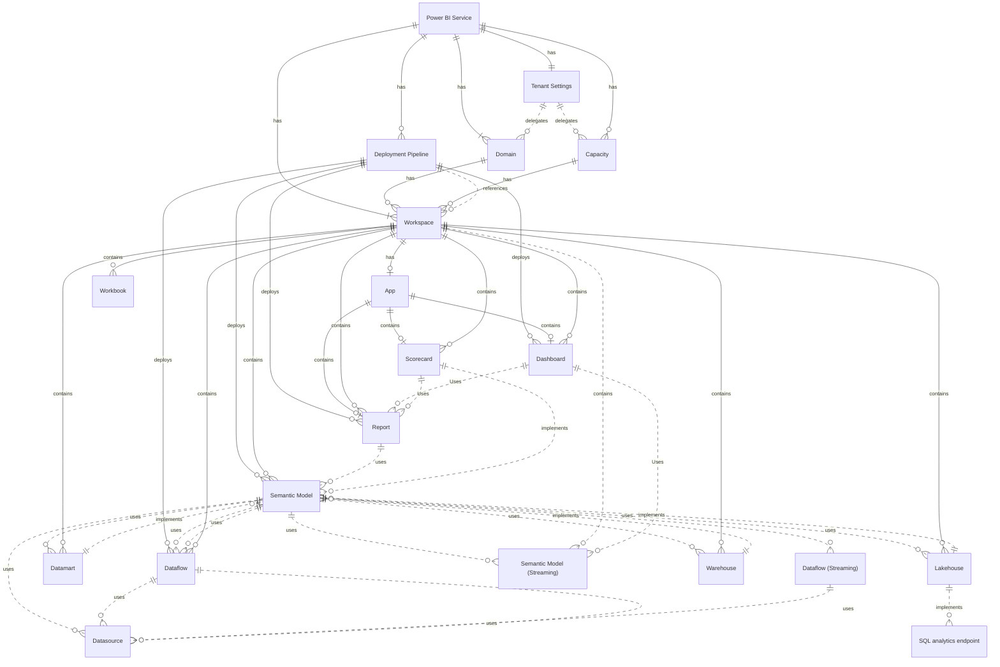

> [!NOTE]  
> If you contribute please be sure to use the [replaceguids](/utils/replaceguids.ps1) script to change any sensitive IDs

Power BI has a low barrier of entry......
It also has a complex underlying model!


# Covering APIs 
| Topic | Content API | Usage/Interaction | Notes |
|-|-|-|-|
| Power BI Service | | | No APIs cover this |
| Workspace |  <ul><li>[Groups-GetGroupsAsAdmin](/pbi-apis/Admin/Groups-GetGroupsAsAdmin)</li><li>[WorkspaceInfo-GetScanResult](pbi-apis\Admin\WorkspaceInfo-GetScanResult)</li></ul> | [Get-Activity-Events](pbi-apis\Admin\Get-Activity-Events) | |
| Tenant Settings | <ul><li>[Get-Tenant-Settings](fabric-apis\Get-Tenant-Settings) (Fabric)</li></ul> | [Get-Activity-Events](pbi-apis\Admin\Get-Activity-Events) | Activity events DO NOT include details for Include/Exclude groups or delegation changes |
| Capacity | <ul><li>[Get-Capacities-As-Admin](pbi-apis\Admin\Get-Capacities-As-Admin)</li>  <li>[Capacities GetCapacityUsersAsAdmin](pbi-apis\Admin\Capacities-GetCapacityUsersAsAdmin)</li></ul> | [Get-Activity-Events](pbi-apis\Admin\Get-Activity-Events) | Not all capacity events are logged, changes to the capacity settings/admins etc are not returned |
| App | <ul><li>[Apps-GetAppsAsAdmin](pbi-apis\Admin\Apps-GetAppsAsAdmin)</li></ul> | [Get-Activity-Events](pbi-apis\Admin\Get-Activity-Events) |Content API does not return audience information|
| Domain | N/A | N/A | No APIs cover this |
| Report | <ul><li>[WorkspaceInfo-GetScanResult](pbi-apis\Admin\WorkspaceInfo-GetScanResult)</li></ul> | [Get-Activity-Events](pbi-apis\Admin\Get-Activity-Events) | Interactions within the report are not captured in the activity events |
| Semantic Model | | [Get-Activity-Events](pbi-apis\Admin\Get-Activity-Events) | |
| Dashboard | | [Get-Activity-Events](pbi-apis\Admin\Get-Activity-Events) | |
| Dataflow | | [Get-Activity-Events](pbi-apis\Admin\Get-Activity-Events) | |
| Lakehouse | | [Get-Activity-Events](pbi-apis\Admin\Get-Activity-Events) | |
| Datamart | | [Get-Activity-Events](pbi-apis\Admin\Get-Activity-Events) | |
| Warehouse | | [Get-Activity-Events](pbi-apis\Admin\Get-Activity-Events) | |
| Gateway | | | |
| Scorecard | | [Get-Activity-Events](pbi-apis\Admin\Get-Activity-Events) | |
| Metric | | [Get-Activity-Events](pbi-apis\Admin\Get-Activity-Events) | |
| Pipeline | [Pipelines-GetPipelinesAsAdmin](pbi-apis/Admin/Pipelines-GetPipelinesAsAdmin) | [Get-Activity-Events](pbi-apis\Admin\Get-Activity-Events) | |
| Template App | | | |

# powerbi-apis
This is initially to provide a base for schema validation and as a reference for future usage of the APIs. 

The Power BI APIs are not all that are required as the Power BI ecosystem extends beyond the REST APIs as documented [here](https://learn.microsoft.com/en-us/rest/api/power-bi/)

# General
## Rest API
Have added a python script to call the apis, you will need to generate a bearer token though for the power bi service. 
See https://learn.microsoft.com/en-us/rest/api/power-bi/

If you want to *cheat* you can grab a bearer token from the 'try it' pane of the REST API docs
See https://learn.microsoft.com/en-us/rest/api/power-bi/admin/groups-get-groups-as-admin#code-try-0

## Powershell cmdlet
Have included the commands for powershell as it is implied [here](https://learn.microsoft.com/en-us/power-bi/enterprise/service-admin-reference) that there is a parity between the cmdlets and the APIs however there are differences as highlighted in the Groups-GetGroupsAsAdmin [detail.md](/pbi-rest-apis/Groups-GetGroupsAsAdmin/detail.md) file.

To execute the powershell scripts you need to install [MicrosoftPowerBIMgmt](https://www.powershellgallery.com/packages/MicrosoftPowerBIMgmt/1.2.1111) and login

```powershell
Install-Module -Name MicrosoftPowerBIMgmt 

Login-PowerBIServiceAccount
```
Generally there is loose parity of feature when the feature has both an administrative and user based context to the API however powershell commands have been included for reference

## .net Client Library
Would welcome contributions

# General resources used
https://www.jsongenerator.io/schema


# Other useful references
* [microsoft / powerbi-powershell](https://github.com/microsoft/powerbi-powershell) repo

* [microsoft /  PowerBI-CSharp](https://github.com/microsoft/PowerBI-CSharp) repo
