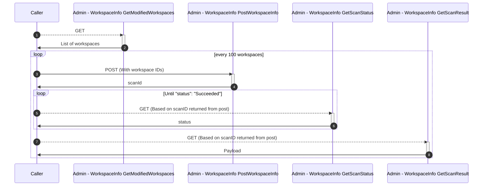

See: https://learn.microsoft.com/en-us/rest/api/power-bi/admin/workspace-info-get-scan-result

This is the end call of a series that need to be executed. 



For the purposes of the docs it is assumed you have added the optional parameters on the "Admin - WorkspaceInfo PostWorkspaceInfo" call
* datasetExpressions=true
* datasetSchema=true
* datasourceDetails=true
* getArtifactUsers=true
* lineage=true


# Call
## REST API
```
GET https://api.powerbi.com/v1.0/myorg/admin/workspaces/scanResult/f676712d-02af-4abf-ac83-6861e0d0cad7
```
Random scan guid above

## Powershell cmdlet
See [ README](../../README.md)

No cmdlet available

# Important
* This a large response which is largely undocumented, the schema almost certianly will deviate!


# Issues experienced
* The documentation provided is very far away from the reponse of this API